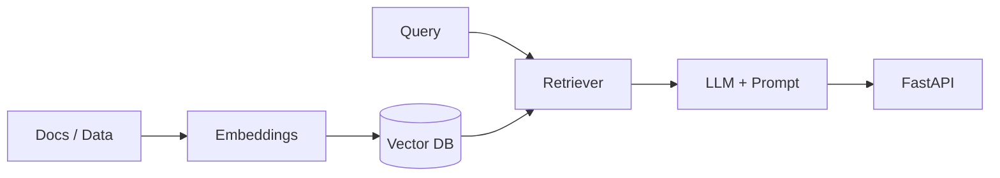

# Adrián Valencia Villanueva
**AI Developer | Python, LLMs & Backend**

Enfocado en desarrollo de IA aplicada: APIs, automatización y experimentos con modelos de lenguaje. Trabajo con código simple, modular y listo para producción.

---

### Stack

 

### Enfoque actual
- LLMs aplicados: RAG, agentes y prompting
- Backend para IA con FastAPI
- MLOps básico: Docker, deploy y evaluación

### Cómo trabajo IA

### Proyectos destacados
- **[viewTag](https://github.com/AdrianValenciaVillanueva/viewTag)** — Proyecto en Python. Creacion de busqueda de relacion con un modelos IA de embedding.
- **[fastapi_deploy](https://github.com/AdrianValenciaVillanueva/fastapi_deploy)** — API / deploy con FastAPI. Ideal para servir modelos.

### Stats

  
  

